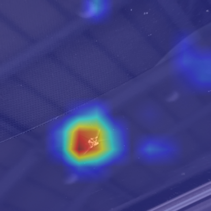
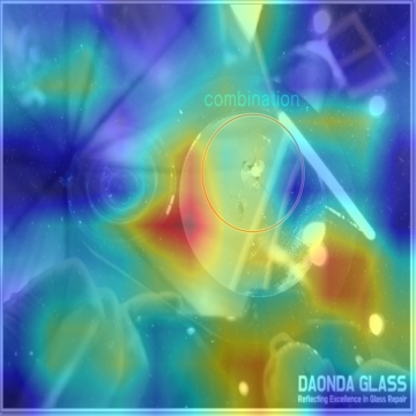
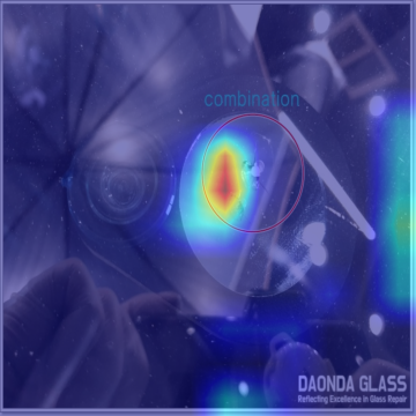
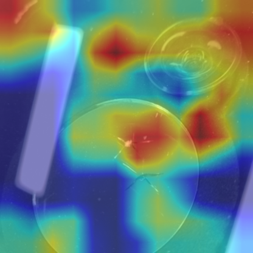
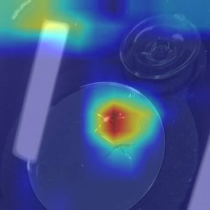

# 🧠 Crop and Conquer: A Dual-Pipeline Framework for Trustworthy Visual Classification

> **Crop and Conquer: A Dual-Pipeline Framework for Trustworthy Visual Classification**  
> This repository provides the **official open-source implementation** of the paper *"Crop and Conquer: A Dual-Pipeline Framework for Trustworthy Visual Classification"*.  
> The study was conducted and authored by **Kyeongha Hwang (Suwon University, Korea)**, who carried out all experiments and analysis.

---

## 🚀 Reproduction Guide

This section describes how to reproduce and execute the provided dual-pipeline framework.

### 1️⃣ Environment Setup

Run the following command to automatically create the environment and install all dependencies:

```bash
bash setup.sh
```

This script will:

- Create a new Conda environment (tf_env)

- Install all Python dependencies listed in requirements.txt

- Clone external repositories (Darknet for YOLOv2/v4 and YOLOv5) into the third_party/ directory

- After setup, activate the environment:

```bash
conda activate tf_env
```

### 2️⃣ Run the Main Pipeline

Once setup is complete, execute the unified pipeline:

```bash
python src/main.py
```

This will run the Crop-and-Conquer dual-pipeline, which consists of:

1. Annotation Cleaning — Removes human-drawn bias marks from images using a generative model

2. YOLO-based Cropping — Detects and crops damage regions via YOLO (v2, v4, v5, v8)

3. Data Augmentation — Balances the dataset using class-aware augmentation

4. Classification & Evaluation — Trains CNN-based classifiers and evaluates performance

### ⚠️ Note on Data Privacy
The original dataset used in this research is private and cannot be shared publicly.
Therefore, this repository only includes a small sample dataset located under:

```bash
data/sample/
```

- The sample dataset allows users to test the prediction and cropping functions.
- However, the training and evaluation phases are disabled (commented out by default)
- since the full dataset and model weights are not publicly released.

### 🧩 Summary

- Main entry point: src/main.py

- Configuration control: All parameters can be managed via utils/config.yaml

- Logging system: All runtime logs are saved automatically under logs/

- Third-party dependencies: Installed under third_party/

- Model checkpoints: Saved under checkpoints/ and saved_model/


📄 For citation, experimental details, and additional documentation, please refer to the paper:
“Crop and Conquer: A Dual-Pipeline Framework for Trustworthy Visual Classification” (Hwang, K., Suwon University).

---

## ⚙️ Module Execution

Each module in this repository is independently executable —  
covering the full process from **training** to **evaluation** and **inference**.

### Example Usage

```bash
python src/annotation_cleaner/annotation_cleaner.py
python src/yolo_cropper/yolo_cropper.py
python src/data_augmentor/data_augmentor.py
python src/classifier/classifier.py
```

### Module Overview
| Module        | Description   |
| ------------- | ------------- |
| AnnotationCleaner  | Takes the original dataset and generates annotation-free images using a generative model (Gemini). |
| YOLOCropper  | Uses fine-tuned YOLO models to detect and crop only the damaged regions of the images.  |
| DataAugmentor  | Splits the generated data into train/validation/test sets and applies augmentation to balance the training dataset. |
| Classifier  | Performs CNN-based classification on the processed data and reports the final accuracy and F1-score.  |

### 🖼️ Example Results (Sample Dataset)

- The following examples illustrate how each stage transforms the image data.
- The original dataset was provided by an industry partner and cannot be shared publicly.
- Hence, sample images are included under data/sample/ for demonstration purposes.

| Category | Original | Original Crop | Generation | Generation Crop |
|:---------:|:---------:|:--------------:|:------------:|:----------------:|
| **Repair** |  |  |  |  |
|            |  |  |  |  |
|           |  |  |  |  |
| **Replace** |  |  |  |  |
|           |   |  |  |  |
|           |  |  |  |  |


---

## 📊 Experimental Results

This study evaluates four different experimental configurations to analyze the effect of bias removal and region-focused learning on classification performance:

| ID | Configuration | Description |
|----|----------------|--------------|
| (a) | **Original → Classifier** | Baseline model trained on the raw dataset |
| (b) | **YOLO Crop → Classifier** | Classifier trained on YOLO-cropped regions of the original images |
| (c) | **Annotation Clean → Classifier** | Classifier trained on generatively cleaned images (human annotation removed) |
| (d) | **Annotation Clean + YOLO Crop → Classifier** | Classifier trained on cleaned and cropped images |

---

### 🎯 Evaluation Focus

The experiments focus on **three main evaluation aspects**:

1. **Grad-CAM Visualization** — Model attention and interpretability  
2. **Classification Accuracy** — Quantitative performance across datasets and models  
3. **Data Reliability** — Bias reduction ratio based on annotation removal  

---

### 🧠 1️⃣ Grad-CAM Visualization

The Grad-CAM analysis illustrates the regions of interest (ROIs) that the classifier focuses on under each experimental setup.

| (a) Original | (b) YOLO Only | (c) Gen Only | (d) Gen + YOLO |
|---------------|---------------|---------------|----------------|
|  |  |  |  |
|  |  |  |  |

> 💡 *Observation:*  
> Models trained on cropped or generatively cleaned data exhibit **stronger activation around the actual damage regions**,  
> suggesting improved spatial attention and interpretability compared to the baseline.

---

### 📈 2️⃣ Classification Accuracy & Data Reliability Analysis

This section presents the **quantitative comparison** of classification performance and dataset reliability across the four experimental settings.  
Each configuration is evaluated using the best-performing model checkpoint obtained from ten independent runs.

| Condition | Data Reliability | Annotation Clean | YOLO Crop | Best Acc (%) |
|------------|------------------|------------------|------------|---------------|
| (a) Original | 66% | ✗ | ✗ | **95.39** |
| (b) YOLO Only | 89.80% | ✗ | ✓ | **97.46** |
| (c) Gen Only | 100% | ✓ | ✗ | **88.94** |
| (d) Gen + YOLO | 100% | ✓ | ✓ | **93.40** |

> 📘 *Notes:*  
> - Each accuracy represents the **best result** among ten independent runs.  
> - **Data Reliability** is defined as \( 1 - \text{Bias Ratio} \), where “bias” corresponds to the proportion of images containing human annotations.  
> - Combining **annotation cleaning** and **YOLO cropping** yields more interpretable models with higher spatial precision,  
>   while the YOLO-only setting achieves the highest quantitative performance.

---

### 🧩 Summary — Ablation Interpretation

The ablation results indicate that:
- **YOLO-based cropping** significantly improves classification accuracy by focusing on relevant local regions.  
- **Generative annotation cleaning** enhances dataset reliability, completely removing human-drawn artifacts.  
- **Combined (Gen + YOLO)** approach provides a balance between interpretability and robustness, demonstrating the effectiveness of the proposed dual-pipeline strategy.

> 🏁 *Conclusion placeholder:*  
> The proposed *Crop and Conquer* framework successfully achieves both **trustworthy learning** and **performance enhancement**  
> through complementary bias removal and region-focused representation learning.

---

---

### 🧠 3️⃣ Interpretation & Discussion

This repository summarizes the **key figures and major quantitative results** from the paper.  
For detailed experimental setups, extended ablation studies, and additional analyses,  
please refer to the full paper:  
> *“Crop and Conquer: A Dual-Pipeline Framework for Trustworthy Visual Classification.”*

The main finding of this study is that applying a **simple YOLO-based Cropping step**  
prior to classification effectively guides the model to focus on the **most relevant damage regions**,  
resulting in improved **attention localization** and **higher classification accuracy**.

We discovered that this effect consistently appears in both:
- **Unbalanced datasets** containing human-annotated bias in a single class, and  
- **Generatively cleaned datasets** constructed via annotation removal using generative AI.

These findings demonstrate that even a minimal preprocessing step can significantly enhance  
model trustworthiness and predictive robustness in **real-world industrial environments**,  
particularly under **limited data conditions** such as class imbalance or biased distributions.

> 🏁 *In summary*, YOLO-based region cropping not only increases quantitative performance  
but also strengthens model interpretability — offering a practical and scalable solution  
for industrial AI applications where data quality and bias remain key challenges.

---