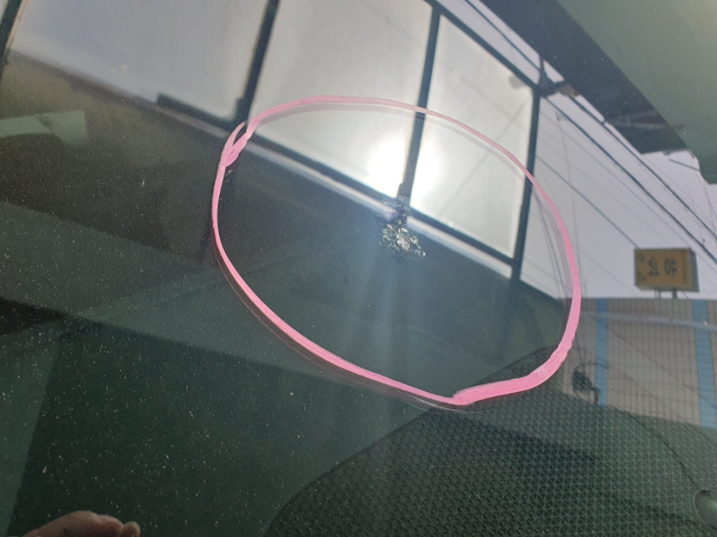
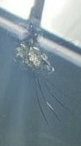

# 🧠 Crop and Conquer: A Dual-Pipeline Framework for Trustworthy Visual Classification

> **Crop and Conquer: A Dual-Pipeline Framework for Trustworthy Visual Classification**  
> This repository provides the **official open-source implementation** of the paper *"Crop and Conquer: A Dual-Pipeline Framework for Trustworthy Visual Classification"*.  
> The study was conducted and authored by **Kyeongha Hwang (Suwon University, Korea)**, who carried out all experiments and analysis.

---

## 🚀 Reproduction Guide

This section describes how to reproduce and execute the provided dual-pipeline framework.

### 1️⃣ Environment Setup

Run the following command to automatically create the environment and install all dependencies:

```bash
bash setup.sh
```

This script will:

- Create a new Conda environment (tf_env)

- Install all Python dependencies listed in requirements.txt

- Clone external repositories (Darknet for YOLOv2/v4 and YOLOv5) into the third_party/ directory

- After setup, activate the environment:

```bash
conda activate tf_env
```

### 2️⃣ Run the Main Pipeline

Once setup is complete, execute the unified pipeline:

```bash
python src/main.py
```

This will run the Crop-and-Conquer dual-pipeline, which consists of:

1. Annotation Cleaning — Removes human-drawn bias marks from images using a generative model

2. YOLO-based Cropping — Detects and crops damage regions via YOLO (v2, v4, v5, v8)

3. Data Augmentation — Balances the dataset using class-aware augmentation

4. Classification & Evaluation — Trains CNN-based classifiers and evaluates performance

### ⚠️ Note on Data Privacy
The original dataset used in this research is private and cannot be shared publicly.
Therefore, this repository only includes a small sample dataset located under:

```bash
data/sample/
```

- The sample dataset allows users to test the prediction and cropping functions.
- However, the training and evaluation phases are disabled (commented out by default)
- since the full dataset and model weights are not publicly released.

### 🧩 Summary

- Main entry point: src/main.py

- Configuration control: All parameters can be managed via utils/config.yaml

- Logging system: All runtime logs are saved automatically under logs/

- Third-party dependencies: Installed under third_party/

- Model checkpoints: Saved under checkpoints/ and saved_model/


📄 For citation, experimental details, and additional documentation, please refer to the paper:
“Crop and Conquer: A Dual-Pipeline Framework for Trustworthy Visual Classification” (Hwang, K., Suwon University).

---

## ⚙️ Module Execution

Each module in this repository is independently executable —  
covering the full process from **training** to **evaluation** and **inference**.

### Example Usage

```bash
python src/annotation_cleaner/annotation_cleaner.py
python src/yolo_cropper/yolo_cropper.py
python src/data_augmentor/data_augmentor.py
python src/classifier/classifier.py
```

### Module Overview
| Module        | Description   |
| ------------- | ------------- |
| AnnotationCleaner  | Takes the original dataset and generates annotation-free images using a generative model (Gemini). |
| YOLOCropper  | Uses fine-tuned YOLO models to detect and crop only the damaged regions of the images.  |
| DataAugmentor  | Splits the generated data into train/validation/test sets and applies augmentation to balance the training dataset. |
| Classifier  | Performs CNN-based classification on the processed data and reports the final accuracy and F1-score.  |

### 🖼️ Example Results (Sample Dataset)

- The following examples illustrate how each stage transforms the image data.
- The original dataset was provided by an industry partner and cannot be shared publicly.
- Hence, sample images are included under data/sample/ for demonstration purposes.

| Category | Original | Original Crop | Generation | Generation Crop |
|:---------:|:---------:|:--------------:|:------------:|:----------------:|
|           |  |  |  |  |
| **Repair** |  |  |  |  |
|           |  |  |  |  |
|           |  |  |  |  |
| **Replace** |  |  |  |  |
|           |  |  |  |  |

